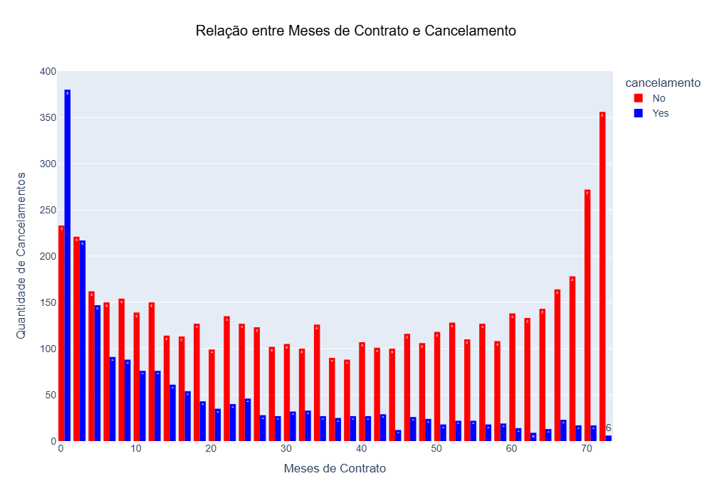
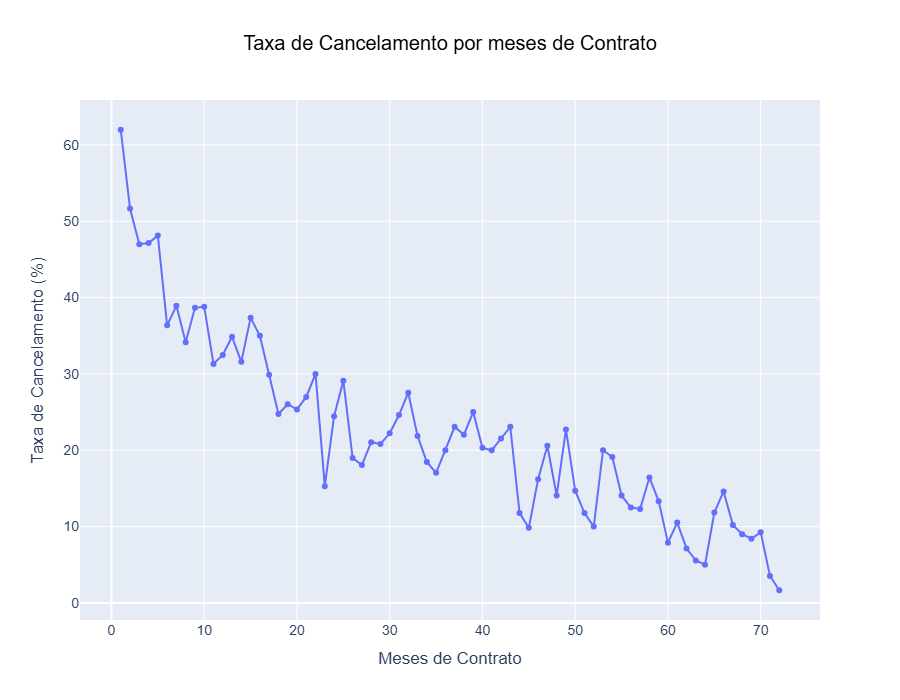
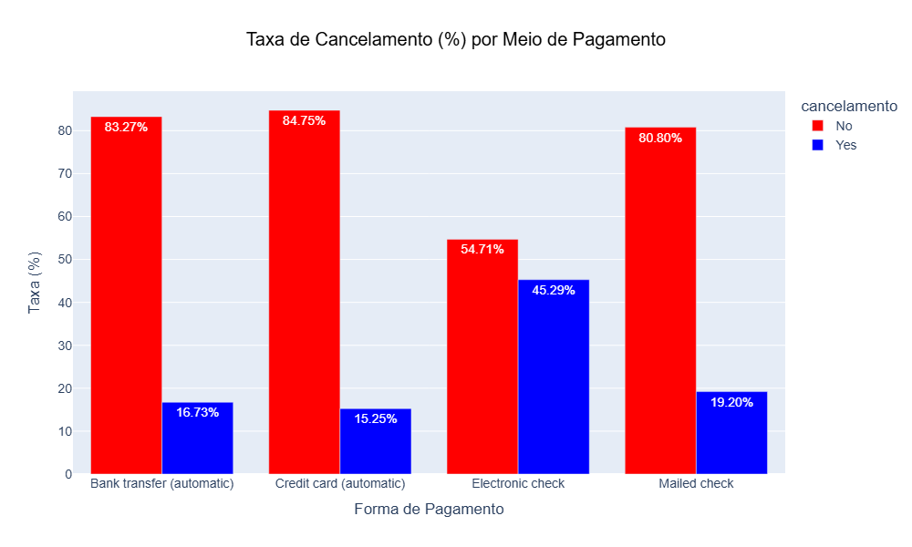
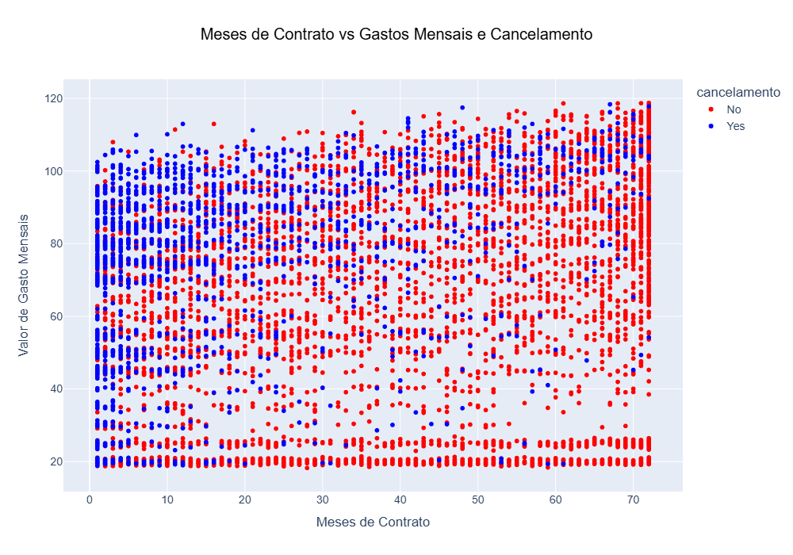
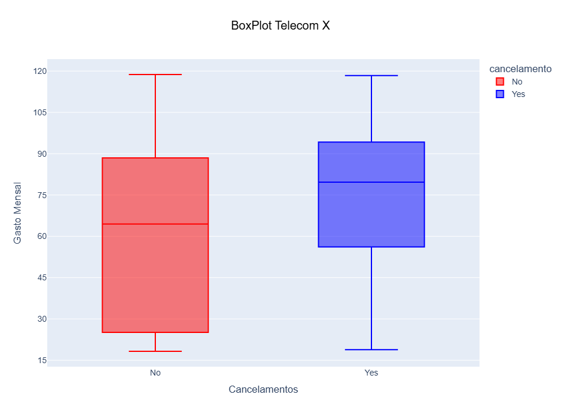
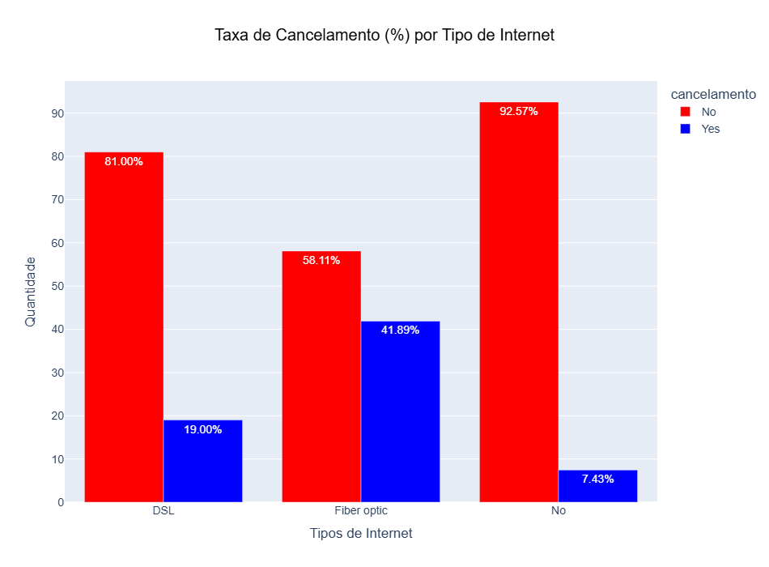

<h1> :bar_chart: Churn de Clientes - Telecom X</h1>

## :round_pushpin: Introdução ao projeto
Este projeto faz parte de um desafio de análise de dados focado em um problema de negócio: a alta taxa de evasão de clientes (Churn) na empresa fictícia Telecom X. Como analista de dados, o objetivo foi explorar uma base de dados de clientes para identificar os principais fatores e perfis que levam ao cancelamento dos serviços.

## :books: Linguagem e Bibliotecas uilizadas
* Python
* Pandas
* Matplotlib
* json
* seaborn
* Numpy
* Ploty Express
* Requests
  
## :notebook_with_decorative_cover: Como utiliza-lo
🚀 Como Utilizar o Projeto

## 1. Clone o repositório ou baixe os arquivos .ipynb
```bash
git clone https://github.com/Gu1lhermeOliveira/Challenge_TelecomX.git
````

## 2. Instale as depedências (caso ainda não tenha)
```bash
import pandas as pd
import requests
import json
import matplotlib.pyplot as plt
import seaborn as sns
import numpy as np
import plotly.express as px
````

## 3. Abra o Google colab ou editor de código da sua escolha
```bash
google colab
````

## :dart: Objetivos da analise

* Identificar o perfil dos clientes com maior probabilidade de cancelamento;
* Analisar a relação entre os serviços contratados (ex: tipo de internet, serviços de proteção, etc...) e a taxa de churn;
* Verificar o impacto do tipo de contrato e do método de pagamento na retenção de clientes;
* verificar a relação entre os (tipos de pagamento, tipos de contrato) e a taxa de churn;
* Entender como o tempo de contrato (meses_de_contrato) e os gastos (gasto_mensal, gasto_total) se correlacionam com a decisão de cancelar.
* Gerar insights para que a empresa possa desenvolver estratégias de retenção eficazes.

## :bulb: Visualização e insights
### 1. 


### 2.


### 3. 


### 4.


### 5.


### 6.


### 6.



## ⚠️ Autor do projeto

### Linkedin: www.linkedin.com/in/guilhermedooliveira
